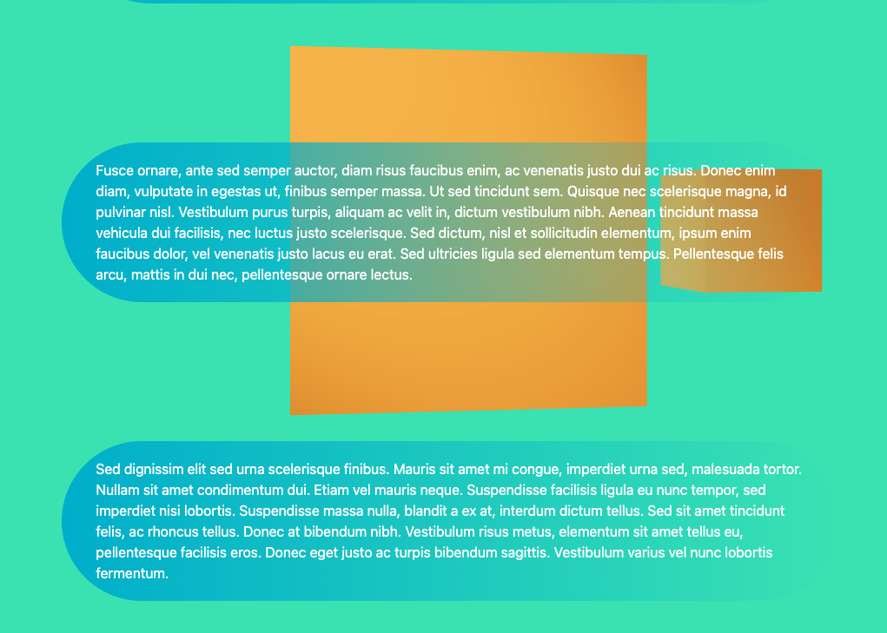

# Simple Next + Three JS app



---
## What are we actually building?
- Next js app
- Tailwind
- Three js rendering
- React-three

---

## Step 1 - new next app

Docs: https://nextjs.org/docs

` npx create-next-app@latest `

---

### Tidy up
- remove guff from main
- remove styles
- remove server guff

#### What are we looking at now?
- todo

---
## Step 2 - install tailwind

because im lost without it

Docs: https://tailwindcss.com/docs/guides/nextjs

`npm install -D tailwindcss postcss autoprefixer`

`npx tailwindcss init -p`

---

- Configure your template paths

- Add Tailwind to global.css

- test it!

literally just copy paste from the docs

---

### Bonus problem:
Cannot find module next/babel

add this to .babelrc file
`{
  "presets": ["next/babel"],
  "plugins": []
}`

and this into .eslintrc
`{
  "extends": ["next/babel","next/core-web-vitals"]
}`

---

## Step 3 - three


`npm install three @react-three/fiber @react-three/drei`

Some Docs:
https://github.com/pmndrs/react-three-fiber
https://github.com/pmndrs/drei#cubecamera
https://threejs.org/docs/

---
### Lets actually render something tho

```
import { Canvas } from "@react-three/fiber";
import { PerspectiveCamera } from "@react-three/drei";

const BackgroundCanvas = () => {
    return (
        <div className="fixed top-0 left-0 z-0 w-full h-full">
            <Canvas 
                shadows
            >
                <PerspectiveCamera 
                    makeDefault 
                    position={[10, 0, 0]}
                />
                <ambientLight intensity={0.5} />
                <spotLight position={[20, 20, 20]} angle={0.15} penumbra={1} />
            </Canvas>
        </div>
    );
}
```

---

### Add a box

```
const Box = (props) => {
    return (
      <mesh
        {...props}
      >
        <boxGeometry args={[1, 1, 1]} />
        <meshStandardMaterial color={'orange'} />
      </mesh>
    )
  }

export default Box;
```
`<Box position={[0, 0, 0]} scale={5} />`

---
## Step 4 - Cool animation

Need to overlay some content

Something like
```
<BackgroundCanvas scrollY={scrollY} />
  <div className="relative z-10 flex flex-col items-center">
    <Textbox text={'This is a sample site to show next.js and three.js'}/>
    ...
```

```
<div className="max-w-4xl p-5 px-10 my-20 text-white rounded-full bg-gradient-to-r from-cyan-500 to-transparent">
  {text}
</div>
```
---

### Get the screen scroll

```
    const [scrollY, setScrollY] = useState(0);
    const onScroll = useCallback(event => {
        setScrollY(window.pageYOffset);
    }, []);
  
    useEffect(() => {
      window.addEventListener("scroll", onScroll, { passive: true });
      // prevent memory leak
      return () => {
         window.removeEventListener("scroll", onScroll, { passive: true });
      }
    }, []);
```
---
### Nerd maths

[image source](https://commons.wikimedia.org/wiki/File:Circle_cos_sin.gif)

---


```
const radius = 15;
const scrollRate = 0.005;
const getX = (i) => Math.cos(i) * radius;
const getY = (i) => Math.sin(i) * radius;
const BackgroundCanvas = ({scrollY}) => {
    const modScroll = scrollY * scrollRate
    ...
    <PerspectiveCamera 
        makeDefault 
        position={[getY(modScroll), 0, getX(modScroll)]} 
        rotation={[0,modScroll,0]}
    />
...
```

---
### Thats it!

Whats missing:

- Hosting, mabe [Github pages](https://pages.github.com/)?
- [Prettier](https://prettier.io/)
- Testing
- Typescript
